# GitHubAI Product Requirements Document

## 0. WHY (What, How, and whY)

**North Star**: Empower developers to automate GitHub workflows via AI-powered issue management, documentation, and maintenance.

**KFI (Key Focus Indicator)**: >75% reduction in manual GitHub maintenance time (measured via weekly automated issue creation vs manual baseline).

**Why**: Developers spend 20-30% of time on maintenance tasks (TODOs, docs, versioning). AI can handle structured repository chores, freeing humans for creative problem-solving.

---

## 1. MVP (Minimum Viable Promise)

1. **As a developer**, I create AI-generated GitHub issues from parent issues so sub-tasks (functional requirements, test plans) are automatically structured.
2. **As a repository maintainer**, I run automated code quality scans so GitHub issues are created for TODOs, documentation gaps, and anti-patterns without manual review.
3. **As an open-source contributor**, I submit bug/feature feedback via simple form so AI generates well-formatted GitHub issues with proper labels and structure.
4. **As a team lead**, I view AI chat interface so I can query repository context and get instant answers without reading documentation.
5. **As a developer**, I access REST API endpoints so I can integrate GitHubAI into CI/CD pipelines and automation workflows.

**Priority**: All stories are P0 Must-Have for v0.1.x MVP. Deferred features in [OOS](#6-oos-out-of-scope).

---

## 2. UX (User eXperience Flow)

### Primary User Flow: Auto-Issue Generation

```text
┌─────────────────┐
│ User triggers   │
│ via CLI/API/UI  │
└────────┬────────┘
         │
         ▼
┌─────────────────┐      ┌──────────────────┐
│ Select chore    │────▶ │ AutoIssueService │
│ type (6 types)  │      │ analyzes repo    │
└─────────────────┘      └────────┬─────────┘
                                  │
                                  ▼
                         ┌──────────────────┐
                         │ AI generates     │
                         │ structured       │
                         │ issue content    │
                         └────────┬─────────┘
                                  │
                                  ▼
                         ┌──────────────────┐
                         │ GitHub Issue     │
                         │ created with     │
                         │ labels + refs    │
                         └──────────────────┘
```

### Secondary Flow: Chat Interface

```text
User → Web UI (React) → REST API → AIService → Multi-provider AI → Response (cached)
```

**Live Demo**: [http://localhost:8000/](http://localhost:8000/) (when running locally)
**Admin Interface**: [http://localhost:8000/admin/](http://localhost:8000/admin/)

---

## 3. API (Atomic Programmable Interface)

| Endpoint | Method | Request | Response | Errors |
|----------|--------|---------|----------|--------|
| `/api/issues/create-auto-issue/` | POST | `{"chore_type": "code_quality", "repo": "owner/repo", "auto_submit": true}` | `{"id": 42, "github_issue_number": 123, "title": "[Auto] Code Quality - 5 items"}` | `400` Invalid chore type, `401` GitHub auth fail, `500` AI API fail |
| `/api/issues/create-from-feedback/` | POST | `{"feedback_type": "bug", "summary": "Login broken", "description": "Details...", "repo": "owner/repo"}` | `{"id": 43, "github_issue_number": 124, "title": "Login broken"}` | `400` Missing required fields, `401` Auth fail |
| `/api/chat/` | POST | `{"message": "How do I deploy?"}` | `{"response": "To deploy...", "provider": "openai", "model": "gpt-4o-mini"}` | `400` Empty message, `500` AI API fail |
| `/api/issues/create-sub-issue/` | POST | `{"repo": "owner/repo", "parent_issue_number": 10, "file_refs": ["README.md"]}` | `{"id": 44, "github_issue_number": 125}` | `400` Invalid parent issue, `404` Parent not found |
| `/health/` | GET | None | `{"status": "ok", "services": ["db", "redis", "ai"]}` | `503` Service unavailable |

**Authentication**: Currently none (local dev only). Production requires Django REST Framework token auth (deferred to post-MVP).

**Examples** (cURL):

```bash
# Auto-issue
curl -X POST http://localhost:8000/api/issues/issues/create-auto-issue/ \
    -H "Content-Type: application/json" \
    -d '{"chore_type": "todo_scan", "auto_submit": true}'

# Chat
curl -X POST http://localhost:8000/api/chat/ \
    -H "Content-Type: application/json" \
    -d '{"message": "What is this project?"}'
```

**Note**: Use `--dry-run` mode for auto-issue to test without GitHub calls.

---

## 4. NFR (Non-Functional Realities)

| Category | Requirement | Metric |
|----------|-------------|--------|
| Latency | Auto-issue analysis completes in <30s | P95 response time |
| Scale | Support 10 concurrent API requests | Load test with 10 users |
| Security | GitHub/AI tokens stored in env vars only | Zero secrets in code/logs |
| Privacy | No sensitive data sent to AI providers | Manual audit of prompts |
| Accessibility | Admin UI uses Django defaults (WCAG 2.1 AA baseline) | Lighthouse score >80 |
| Reliability | 99% uptime for core services (web, db, redis) | Healthcheck monitoring |
| Cost | AI API costs <$5/month for typical usage (100 requests) | Token usage tracking |
| Compatibility | Docker Compose 2.x, PostgreSQL 14+, Python 3.11/3.12/3.13 | CI tests on min versions |

**MVP Focus**: Latency and Security are P0. Scale/Reliability deferred to production deployment.

---

## 5. EDGE (Exceptions, Dependencies, Gotchas, Errors)

**Dependencies**:

- **GitHub API**: Rate limit 5000/hour (authenticated). Mitigation: Cache responses, batch requests.
- **AI Providers**: OpenAI/XAI/Anthropic APIs. Mitigation: Multi-provider fallback via `AIProviderFactory`.
- **Redis**: Required for Celery (background tasks). Gotcha: Must run before web service starts.
- **PostgreSQL**: Required for Django ORM. Gotcha: Migrations must run on first boot.

**Exceptions**:

- `GitHubException(401)`: Invalid `GITHUB_TOKEN`. User must regenerate token.
- `AIServiceException`: AI API key invalid or quota exceeded. Check logs for provider errors.
- `UniqueConstraintError`: Attempting to create duplicate `PromptTemplate` name. Append version suffix (e.g., "v2").

**Gotchas**:

- Docker commands **must** use full path: `docker-compose -f infra/docker/docker-compose.yml exec web <cmd>`.
- PYTHONPATH modified in `settings.py` to include `apps/` directory—imports use `from core.models` not `from apps.core.models`.
- Django admin actions (e.g., prompt refinement) require custom templates in `apps/core/templates/admin/`.

**TDD (Technical Debt Disclaimer)**:

- Authentication deferred to post-MVP (local dev only for v0.1.x).
- Celery tasks defined but not scheduled (manual trigger only).
- Frontend has no authentication—open chat interface (production requires login).

---

## 6. OOS (Out Of Scope)

**Explicitly Killed for MVP**:

- ❌ **Multi-language support**: Python-only for code analysis (post-MVP: JavaScript, Go, Rust).
- ❌ **Real-time collaboration**: Multiple users editing same issue (use GitHub's native collab).
- ❌ **Custom AI model training**: Use off-the-shelf providers (OpenAI, XAI, Anthropic).
- ❌ **Mobile apps**: Web UI only (responsive design sufficient).
- ❌ **Billing/subscriptions**: Free tier only (monetization post-MVP).
- ❌ **Advanced analytics**: Basic usage tracking only (dashboard post-MVP).
- ❌ **Webhook automation**: Manual triggers only (GitHub Actions integration post-MVP).

**Note**: These are "won't-haves" until v0.5.0+.

---

## 7. ROAD (Rolling Objectives And Dates)

| Milestone | Objective | Date/Quarter |
|-----------|-----------|--------------|
| **v0.3.0** (Done) | AI Chat Frontend - React UI + REST API | 2025-11-22 |
| **v0.4.0** (Done) | Prompt Refinement - AI-powered prompt generation via admin | 2025-11-23 |
| **v0.4.1** (Done) | Minor bug fixes and stability improvements | 2025-11-25 |
| **v0.5.0** (Current) | PRD MACHINE - AI-powered PRD automation | 2025-11-29 |
| **v0.6.0** (Next) | Authentication + API Tokens - Secure multi-user access | Q1 2026 |

**RICE Scoring** (Reach × Impact × Confidence / Effort):

- v0.3.0: (100 users × 3 impact × 0.9 confidence) / 5 weeks = 54
- v0.4.0: (50 users × 2 impact × 0.8 confidence) / 1 week = 80
- v0.4.1: (50 users × 1 impact × 0.9 confidence) / 0.5 week = 90
- v0.5.0: (75 users × 3 impact × 0.85 confidence) / 2 weeks = 95 ← **Highest priority**
- v0.6.0: (200 users × 4 impact × 0.7 confidence) / 8 weeks = 70

---

## 8. RISK (Risks, Impacts, Strategies, and Key-mitigations)

| Risk | Impact (RICE) | Mitigation |
|------|---------------|------------|
| AI API cost overruns (>$100/month) | High (breaks budget) | Implement aggressive caching via `AIResponse` model; set monthly quota alerts; use cheaper models (gpt-4o-mini). |
| GitHub rate limit throttling | Medium (blocks auto-issue) | Batch file fetches; implement exponential backoff; use conditional requests (ETags). |
| Docker compose conflicts on user machines | Low (dev friction) | Provide `docker-compose down -v` troubleshooting steps; test on Mac/Linux/WSL. |

**Top Mitigation**: AI cost monitoring is P0—add `APILog` dashboard to admin showing daily spend.

---

## 9. DONE (Definition Of Notable Essentials)

### Machine Checks (Binary ✅)

- [ ] All pytest tests pass: `pytest --cov=apps.core` shows >90% coverage
- [ ] Docker compose builds without errors: `docker-compose up` succeeds on fresh clone
- [ ] Healthcheck returns 200: `curl http://localhost:8000/health/` → `{"status": "ok"}`
- [ ] Admin login works: `http://localhost:8000/admin/` with superuser credentials
- [ ] Auto-issue dry-run succeeds: `python manage.py auto_issue --dry-run` outputs Markdown
- [ ] Chat API returns response: `curl -X POST http://localhost:8000/api/chat/ -d '{"message":"test"}'`

### Human Checks (Subjective ✅)

- [ ] Product owner reviews GitHub issue generated by auto-issue feature and approves quality
- [ ] QA verifies chat interface responds coherently to 5 test questions
- [ ] Security audit confirms no secrets in logs/code (grep for `GITHUB_TOKEN`, `AI_API_KEY`)
- [ ]

---

## 10. ERD (Entity Relationship Diagram)

```mermaid
erDiagram
    %% AI Provider Configuration
    AIProvider ||--o{ AIModel : "has models"
    AIModel ||--o{ AIResponse : "generates"
    AIModel ||--o{ PromptTemplate : "used by"
    AIModel ||--o{ PromptExecution : "executes"

    %% Issue Management
    IssueTemplate ||--o{ Issue : "generates"
    Issue ||--o{ Issue : "has sub-issues"
    Issue ||--o{ IssueFileReference : "references"

    %% Prompt Management
    PromptTemplate ||--o{ PromptSchema : "validated by"
    PromptTemplate ||--o{ PromptDataset : "tested by"
    PromptTemplate ||--o{ PromptExecution : "executed as"
    PromptTemplate ||--o{ PromptTemplate : "versions"
    PromptDataset ||--o{ PromptDatasetEntry : "contains"

    %% PRD Machine
    PRDState ||--o{ PRDVersion : "has versions"
    PRDState ||--o{ PRDEvent : "receives events"
    PRDState ||--o{ PRDConflict : "has conflicts"
    PRDState ||--o{ PRDExport : "exports to"

    AIProvider {
        int id PK
        string name UK "openai, xai, anthropic"
        string display_name
        string api_base_url
        boolean is_active
        boolean is_default
        datetime created_at
        datetime updated_at
    }

    AIModel {
        int id PK
        int provider_id FK
        string name "gpt-4o, grok-2"
        string display_name
        int max_tokens
        float default_temperature
        decimal cost_per_1k_input
        decimal cost_per_1k_output
        boolean is_active
        boolean is_default
    }

    APILog {
        int id PK
        string api_type "ai, github"
        string endpoint
        string method
        jsonb request_data
        jsonb response_data
        int status_code
        text error_message
        int duration_ms
        datetime created_at
    }

    AIResponse {
        int id PK
        int ai_model_id FK
        string prompt_hash UK
        text system_prompt
        text user_prompt
        text response_content
        string provider
        string model
        float temperature
        int tokens_used
        int cache_hit_count
        datetime created_at
    }

    IssueTemplate {
        int id PK
        string name UK
        text about
        string title_prefix
        jsonb labels
        text prompt
        text template_body
        jsonb include_files
        boolean is_active
    }

    Issue {
        int id PK
        int parent_issue_id FK
        int template_id FK
        int github_issue_number
        string github_repo
        string title
        text body
        string issue_type "feature, bug, readme"
        jsonb labels
        string state
        boolean ai_generated
        text ai_prompt_used
        string html_url
    }

    IssueFileReference {
        int id PK
        int issue_id FK
        string file_path
        text content
        string content_hash
    }

    PromptTemplate {
        int id PK
        int ai_model_id FK
        int parent_version_id FK
        string name UK
        string category
        text description
        text system_prompt
        text user_prompt_template
        string provider
        float temperature
        int max_tokens
        int version_number
        boolean is_active
        int usage_count
        datetime last_used_at
    }

    PromptSchema {
        int id PK
        int prompt_id FK
        string schema_type "json_schema, regex"
        jsonb schema_definition
        boolean validation_enabled
        text description
    }

    PromptDataset {
        int id PK
        int prompt_id FK
        string name
        text description
        boolean is_active
    }

    PromptDatasetEntry {
        int id PK
        int dataset_id FK
        jsonb input_variables
        text expected_output_pattern
        jsonb tags
        text notes
    }

    PromptExecution {
        int id PK
        int prompt_id FK
        int ai_model_id FK
        jsonb input_variables
        text rendered_system_prompt
        text rendered_user_prompt
        text output_content
        string provider_used
        string model_used
        int tokens_used
        int duration_ms
        boolean cache_hit
        boolean success
        int user_feedback_rating
    }

    ChangelogEntry {
        int id PK
        string entry_type "commit, pr, manual"
        string commit_sha
        int pr_number
        text commit_message
        text ai_generated_content
        string file_path
    }

    DocumentationFile {
        int id PK
        string file_path UK
        string language
        jsonb docstrings
        jsonb comments
        text markdown_content
        string content_hash
    }

    Version {
        int id PK
        string version_number UK
        int major
        int minor
        int patch
        string bump_type
        string commit_sha
        string git_tag
        boolean is_published
        datetime published_at
    }

    PRDState {
        int id PK
        string repo
        string file_path
        text content
        string content_hash
        string version
        boolean is_locked
        boolean auto_evolve
        datetime last_distilled_at
        datetime last_synced_at
        string slack_webhook
    }

    PRDVersion {
        int id PK
        int prd_state_id FK
        int reverted_to_id FK
        string version
        text content
        string content_hash
        text change_summary
        string trigger_type
        string trigger_ref
        boolean is_human_edit
    }

    PRDEvent {
        int id PK
        int prd_state_id FK
        string event_type "push, pr, issues"
        jsonb event_data
        boolean processed
        datetime processed_at
        text result
    }

    PRDConflict {
        int id PK
        int prd_state_id FK
        string conflict_type
        text description
        string severity "low, medium, high"
        string section_affected
        text suggested_resolution
        boolean resolved
        string resolved_by
    }

    PRDExport {
        int id PK
        int prd_state_id FK
        string export_type "github_issues, jira"
        jsonb export_data
        string status "pending, completed"
        text result
    }
```



**Legend**:

- `PK` = Primary Key, `FK` = Foreign Key, `UK` = Unique Key
- All models inherit from `TimeStampedModel` (auto `created_at`, `updated_at`)
- `jsonb` fields store JSON arrays or objects
