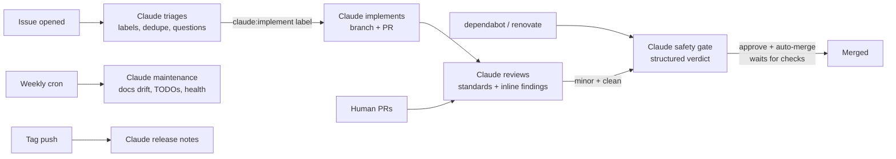

# GitHubAI — the Claude Code SDLC framework

Wire [Claude Code](https://claude.com/claude-code) into every stage of a repository's lifecycle with one install command. Claude triages every issue, implements approved work, reviews every PR, safely auto-merges minor updates, runs weekly maintenance, and drafts releases — as GitHub Actions, with **Claude Code OAuth as the default auth**, no servers required.

GitHubAI is three things at once:

- **A framework** — reusable, hardened workflows and a composite action you reference at a ref, so every adopting repo upgrades by bumping one tag.
- **A template** — repo-type profiles (library, webapp, service, cli, github-action, docs, data, template) that set standards based on what your repo *is* and what it's *for*.
- **The seed of a GitHub App** — an [app manifest and webhook relay](app/) that route org-wide events into the same workflows; the hosted multi-tenant app is the [roadmap](PRD.md).

## How it works



Every box runs `anthropics/claude-code-action@v1` authenticated OAuth-first, and every prompt is grounded in your repo's resolved standards: framework defaults ← repo-type profile ← your `.github/githubai.yml`.

## Quickstart (any repo, ~2 minutes)

```bash
# from your repo's root
curl -fsSL https://raw.githubusercontent.com/bamr87/githubai/main/setup/install.sh | bash -s -- --labels

# authenticate: Claude Code OAuth token is the default for every workflow
claude setup-token
gh secret set CLAUDE_CODE_OAUTH_TOKEN
```

Then install the [Claude GitHub App](https://github.com/apps/claude) on the repo, set `repo.purpose` in the generated `.github/githubai.yml`, and open an issue — Claude triages it within minutes. Full walkthrough: [docs/getting-started.md](docs/getting-started.md).

## The automation surface

| Workflow | Trigger | What Claude does |
|----------|---------|------------------|
| [`claude.yml`](.github/workflows/claude.yml) | `@claude` mention, issue assignment | Interactive: answers, fixes, implements whatever you ask |
| [`claude-triage.yml`](.github/workflows/claude-triage.yml) | issue opened/reopened | Labels type/priority/size, finds duplicates, asks clarifying questions |
| [`claude-implement.yml`](.github/workflows/claude-implement.yml) | `claude:implement` label | Builds the issue on a branch, runs your tests, opens a PR |
| [`claude-review.yml`](.github/workflows/claude-review.yml) | PR opened/ready, `claude:review` label | Reviews against your repo type's standards, inline comments + verdict |
| [`claude-auto-merge.yml`](.github/workflows/claude-auto-merge.yml) | `claude:auto-merge` label, trusted bot PRs | Read-only safety verdict; approves and enables auto-merge only for low-risk minor changes |
| [`claude-maintenance.yml`](.github/workflows/claude-maintenance.yml) | weekly cron, manual | Docs drift, TODO sweep, dependency report, stale nudges, health report |
| [`claude-release.yml`](.github/workflows/claude-release.yml) | tag push, manual | Categorized release notes; version-bump release PRs |

Each workflow doubles as a reusable workflow (`workflow_call`), which is exactly how installed repos consume them — details in [docs/workflows.md](docs/workflows.md).

## Standards from repo type and purpose

The [profiles](profiles/) encode what "good" means per repo type — a library gets semver-compatibility review focus, a webapp gets migration-safety and security focus, a GitHub Action repo gets injection and pinning focus. Your `.github/githubai.yml` picks the type, states the purpose, and overrides anything:

```yaml
repo:
  type: library
  purpose: "Date-parsing library consumed by our billing services."
automation:
  auto_merge:
    enabled: true            # dependabot patch bumps merge themselves when green
standards:
  test_command: npm test
```

Schema reference: [docs/configuration.md](docs/configuration.md). Labels are the control plane: `claude:implement` authorizes work, `claude:auto-merge` nominates a PR for the merge lane, `claude:skip` opts anything out, `claude:needs-human` is Claude escalating to you.

## Auth: Claude Code OAuth by default

Every workflow authenticates with `CLAUDE_CODE_OAUTH_TOKEN` (from `claude setup-token` — included in Claude subscriptions) and falls back to `ANTHROPIC_API_KEY` only when the OAuth token is absent. One org-level secret can power every repo. Threat model, permissions, and the auto-merge safety design: [docs/security.md](docs/security.md).

## Repository layout

```text
.github/workflows/   the framework: reusable claude-*.yml + this repo's CI
actions/load-config/ composite action resolving profile + repo config
profiles/            repo-type standards (the "based on type and purpose" part)
template/            what the installer copies into adopting repos
setup/install.sh     the one-command installer
app/                 GitHub App manifest + webhook relay (app mode)
docs/                getting started, configuration, workflows, security, architecture
tests/               self-tests keeping the framework honest
```

This repo runs its own framework — the workflows above are live here, configured by [.github/githubai.yml](.github/githubai.yml) with the `template` profile. If the machinery doesn't work on itself, it doesn't ship.

## Migrating from GitHubAI v0.x

The Django/React application that previously lived here (last release v0.5.3) was replaced by this framework; every v0 capability has a lighter successor. See [docs/migration-v0.md](docs/migration-v0.md).

## License

[MIT](LICENSE)
